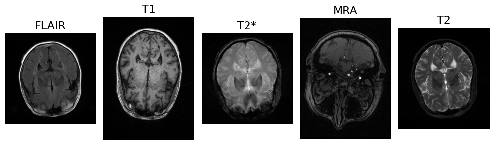
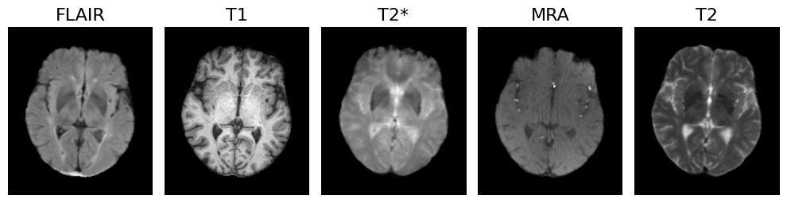

# mlmi-project
Self-supervised Multimodal Representation Learning - Machine Learning in Medical Imaging Course Project Summer 2023

## [Pre-processing Scripts](https://github.com/KnightTec/mlmi-project/tree/main/preprocessing)

The MRI brain scan pre-processing pipeline developed for this project performs the following steps:
1. Re-orientation to LPS
2. Intra-session resampling of T2, T2*, FLAIR, and MRA to T1
3. Isotropic resampling to a resolution of 1mm
4. Skull stripping using SynthStrip 
5. Intra-session rigid registration of T2, T2*, FLAIR, and MRA to T1 using
SynthMorph
6. Centering the brain inside the volume and cropping to a resolution of
180 × 210 × 155

Before pre-processing:

After pre-processing:

## Experiment Scripts
- [Alzheimer’s classification with pre-trained Swin Transformer](https://github.com/KnightTec/mlmi-project/blob/main/mri_classifier_miriad.ipynb)
- [DenseNet Fusion (Unimodal)](https://github.com/KnightTec/mlmi-project/blob/main/mri_ad_cls_unimodal_oasis_2d.py)
- [DenseNet Fusion (Decision Level)](https://github.com/KnightTec/mlmi-project/blob/main/mri_ad_cls_multimodal_decision_fusion_oasis_2d.py)
- [DenseNet Fusion (Input Level)](https://github.com/KnightTec/mlmi-project/blob/main/mri_ad_cls_multimodal_input_fusion_oasis_2d.py)
- [DenseNet Fusion (Input Level with Partial Convolution and Soft Gating)](https://github.com/KnightTec/mlmi-project/blob/main/input_fusion_oasis_2d_new.py)
- [MAE Fusion(Unimodal)](https://github.com/KnightTec/mlmi-project/blob/main/M3AE_unimodal_T2.ipynb)
- [MAE Fusion(Input level)](https://github.com/KnightTec/mlmi-project/blob/main/mae_input_fusion_oasis_2d.ipynb)
- [MAE Pretraining](https://github.com/KnightTec/mlmi-project/blob/main/M3AE_pretrain2.ipynb)
- [MAE Miriad Classification](https://github.com/KnightTec/mlmi-project/blob/main/Miriad_classification.ipynb)
- [Dinov2 (Unimodal)](https://github.com/KnightTec/mlmi-project/blob/main/dinov2_unimodal_oasis_2d%20.py)
- [Dinov2 Fusion (Input Level)](https://github.com/KnightTec/mlmi-project/blob/main/dinov2_input_fusion_oasis_2d.py)
- [Dinov2 Fusion (Decision Level)](https://github.com/KnightTec/mlmi-project/blob/main/dinov2_decision_fusion_oasis_2d.py)
